## EMBEDDED SUBTITLES TOOL
*A tool for isolating and extracting subtitles which are embedded directly onto videos.*

**Motivation** : In online spaces, and in archived films, it is a somehwat common practice to embed subtitles directly onto video, which disallows both translation and subtitle retrieval. This practice is extremely common on short-form video content in multiple languages.\
This data is often 
1. Meticulously transcribed
2. Audio timed
3. In the language of the video (in the case of online spaces)
4. Colloquial and Slang-filled

*Examples*: \
*[Loris Giuliano](https://www.youtube.com/@loris.giuliano)*, a (very popular) French Youtuber\
This version of  *[The Color of Pomegranates](https://archive.org/details/ColorOfPomegranates-SayatNova1968)* (the only freely availible subtitled version)
### *Usage*

TODO

### *Process*
*Image Segemention -> Masking -> Text Extraction*

#### Image Segmentation
*A U-Net Encoder Decoder CNN which can identify where the text in a subtitled video appears.*

**Training**

Given a directory of training videos:\
The frames from this video are extracted, possibly by skipping frames.\
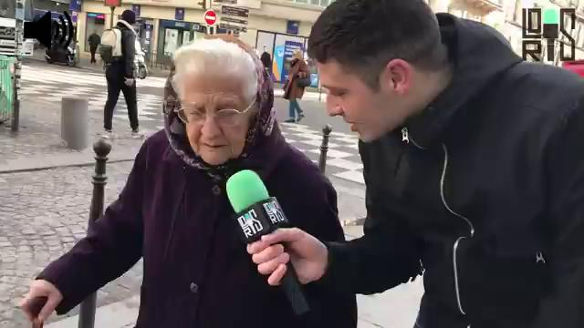\
Text is added to these frames, with varying lengths, fonts, positions, and sizes.\
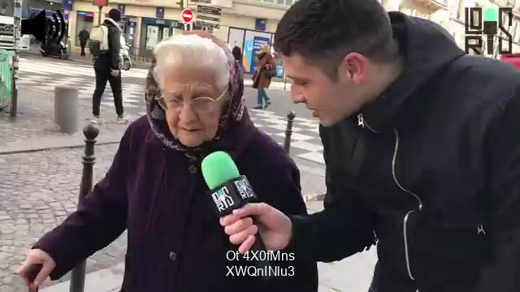\
Edge detection is performed, to minimize image size and complexity.
\
 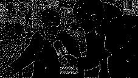 \
This image is the training data, and a mask is created indicating the location of the generated text.\
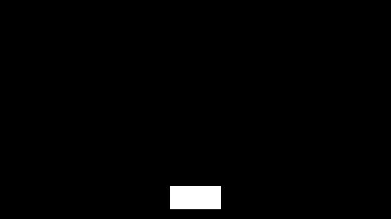\
The CNN is trained on this data (different images here, label mask on right)\
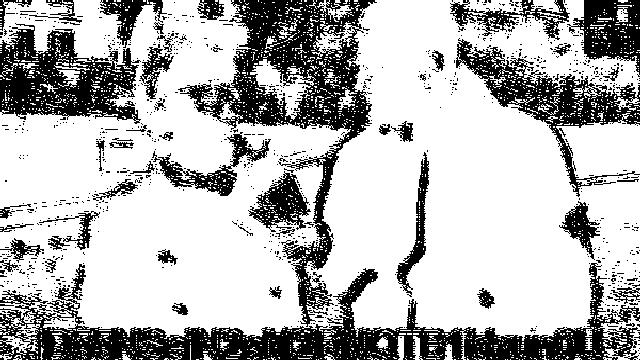
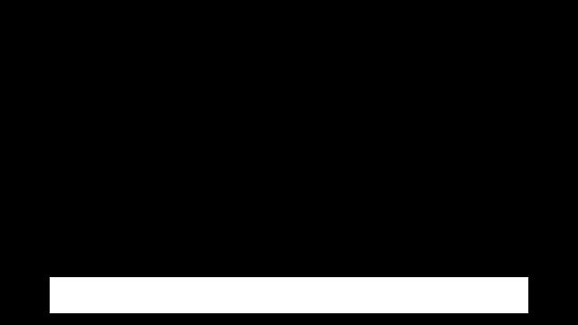
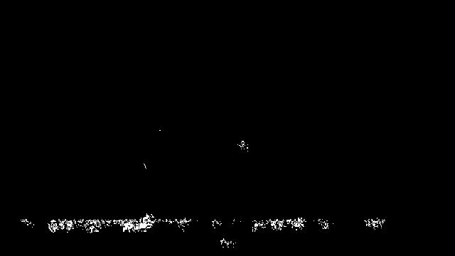
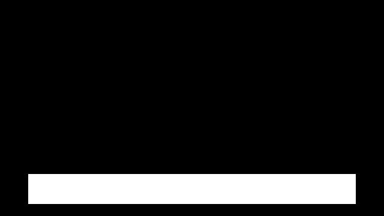\
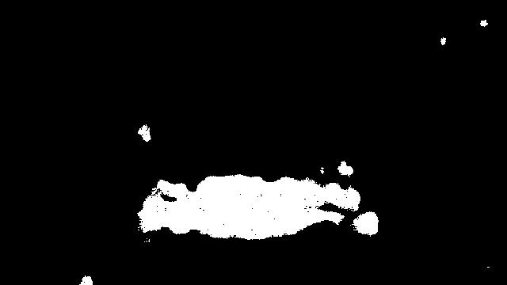
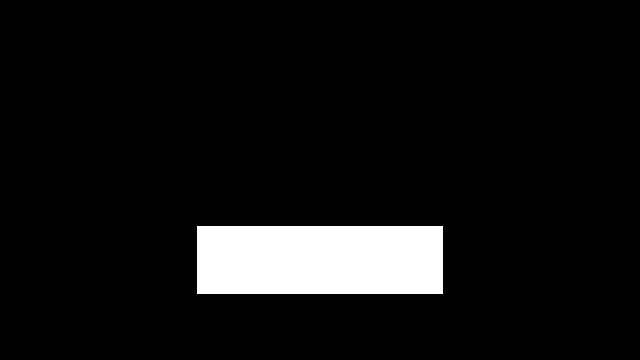
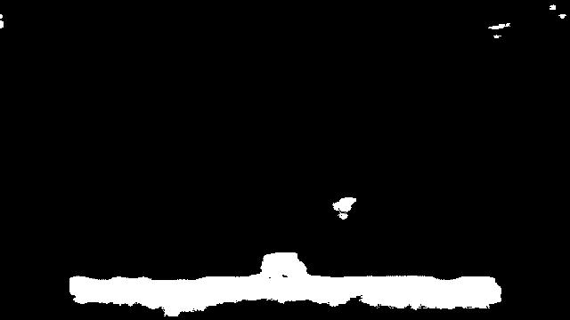

**Prediction**

These masks are manipluated based on properties of subtitle areas
- Rectangular Shape
- Centered
- Left-Right padding encouraged

Here is a real prediction example:

Image -> Edge-detection -> CNN -> Mask Manipulation -> Mask Applied

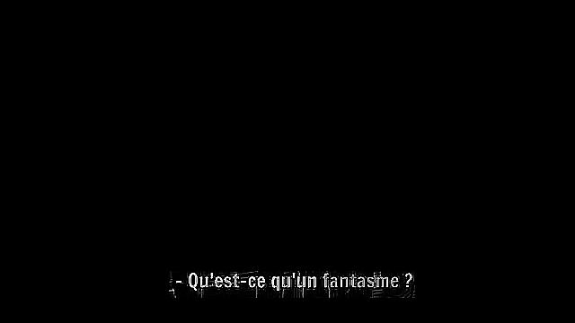

**Future work:**
1) These extractions function suprisingly poorly with Google Tesseract OCR, even with color inversion and smoothing\
Output: << *-Qu'estce qu'umfanism P* >>

    *Possible Fixes:*
    - Different OCR
    - Statistical Matching (breaks use-case of colloquial speech)
    - More intense masking, currently rectanglar

2) Accuracy Metrics\
    For my first approaches to this problem, I used a regression neural network, where the output was a vector of four pixel values indicating the top-left corner and bottom right corner (x1, y1, x2, y2) of the mask rectangle. \
    This approached used an IoU loss function, and for determining the efficacy of this model a IoU adjecent accuracy metric would be very apt, but I have not measured the models accuracy as of yet.
