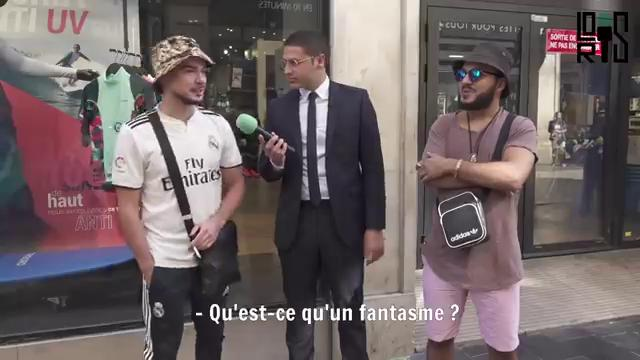

## EMBEDDED SUBTITLES TOOL
*A tool for isolating and extracting subtitles which are embedded directly onto videos.*

*Examples*: \
*[Loris Giuliano](https://www.youtube.com/@loris.giuliano)*, a (very popular) French Youtuber\
Archived films in translation, such as this version of *[The Color of Pomegranates](https://archive.org/details/ColorOfPomegranates-SayatNova1968)*
### *Usage*

TODO

### *Process*
*Image Segemention -> Masking -> Text Extraction*

#### Image Segmentation
*A U-Net Encoder Decoder CNN which can identify where the text in a subtitled video appears.*

**Training**

Given a directory of training videos.\
The frames from this video are extracted, possibly by skipping frames.\
\
Text is added to these frames, with varying lengths, fonts, positions, and sizes.\
\
Edge detection is performed, to minimize image size and complexity.
\
  \
This image is the training data, and a mask is created indicating the location of the generated text.\
\
The CNN is trained on this data (different images here, label mask on right)\

\

**Prediction**

These masks are manipluated based on properties of subtitle areas
- Rectangular Shape
- Centered
- Left-Right padding encouraged

Here is a real prediction example:

Image -> Edge-detection -> CNN -> Mask Manipulation -> Mask Applied

**Future work:**\
These extractions function suprisingly poorly with Google Tesseract OCR, even with color inversion and smoothing\
Output: *-Qu'estce qu'umfanism P*

*Possible Fixes:*
- Different OCR
- Statistical Matching (breaks use-case of colloquial speech)
- More intense masking, currently rectanglar

